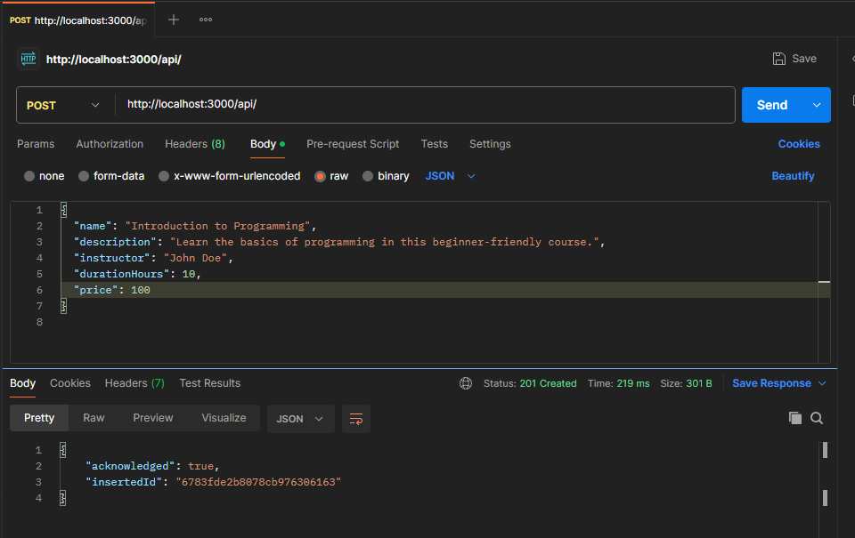
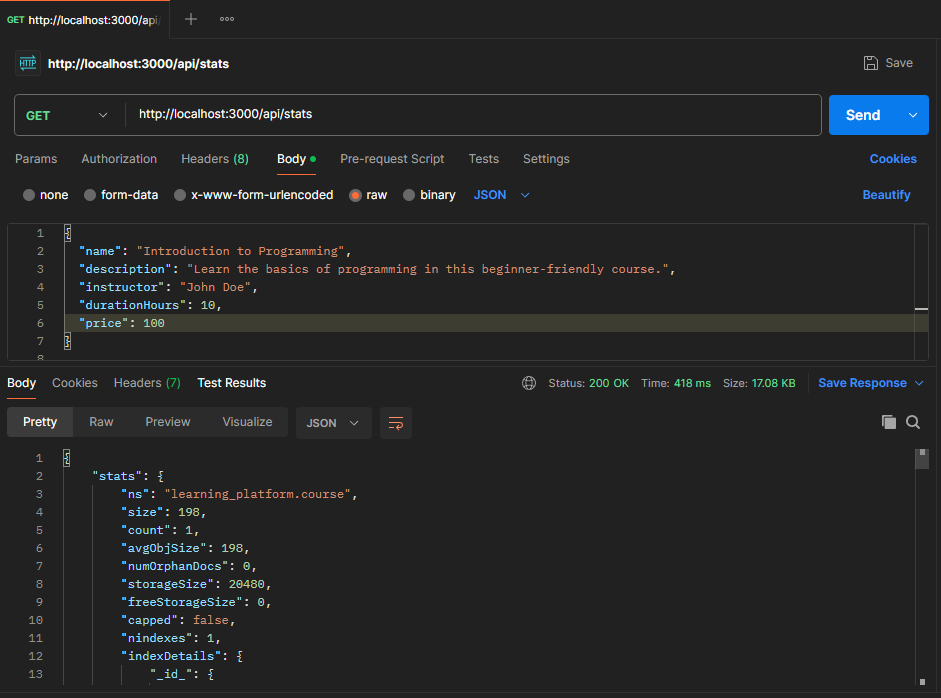
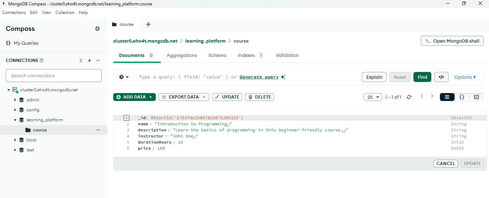
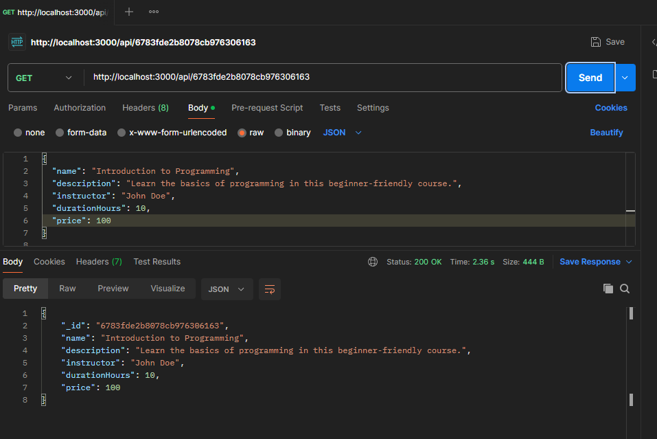

# Projet de Fin de Module : NoSQL

**Auteur :** DIOUANE Hicham  
**Statut du Projet :** Terminé  
**Prochaine étape :** Nettoyage du code (suppression des `console.log` inutiles).

---

## Instructions pour Exécuter le Projet

### Installation des dépendances :

```bash
npm install
```

### Démarrage du serveur :

```bash
npm start
```

---

## Structure du Projet

### Organisation des Fichiers

- **`app.js`** : Point d'entrée principal du projet.
  - Initialise l'application.
  - Gère les erreurs.
- **`env.js`** : Validation des variables d'environnement.
  - Vérifie que toutes les configurations nécessaires sont disponibles.
- **`db.js`** : Gestion des connexions à la base de données.
  - Centralisation des connexions.
  - Fermeture propre des connexions via `try...finally`.
- **`courseController.js`** : Contient la logique métier des fonctionnalités.
- **`redisService.js`** : Gestion du cache avec Redis.
  - Implémente des stratégies d'invalidation du cache.
  - Utilise des clés descriptives (ex : `user:123:profile`).
- **`mongoService.js`** : Services pour interagir avec MongoDB.
- **`courseRoutes.js`** : Organisation des routes par fonctionnalité.

---

## Tests des API avec Postman

- **API `/stats`** : Fonctionne correctement.
- **API `/:id`** : Fonctionne correctement.
- **API `/`** : Fonctionne correctement.

---

## Choix Techniques

### Pourquoi créer un module séparé pour les connexions aux bases de données ?
Créer un module séparé permet de :
- Centraliser la gestion des connexions.
- Faciliter la maintenance et les modifications.
- Réutiliser le code de manière efficace.

### Comment gérer proprement la fermeture des connexions ?
- Utiliser un bloc `try...finally` pour s'assurer que les connexions sont toujours fermées.
- Automatiser la gestion des ressources avec des gestionnaires ou des pools de connexions.

### Pourquoi valider les variables d'environnement au démarrage ?
- S'assurer que l'application dispose de toutes les configurations nécessaires.
- Prévenir les erreurs de configuration et garantir un comportement stable.
- Simplifier le déploiement dans différents environnements.

### Que se passe-t-il si une variable requise est manquante ?
- L'application peut échouer au démarrage ou fonctionner de manière imprévisible.
- Cela peut entraîner des problèmes de performance, de sécurité ou de fonctionnalité.

### Quelle est la différence entre un contrôleur et une route ?
- **Route** : Définit l'URL et la méthode HTTP associée.
- **Contrôleur** : Contient la logique métier pour traiter les requêtes et envoyer des réponses.

### Pourquoi séparer la logique métier des routes ?
- Maintenir un code propre et modulaire.
- Faciliter les tests unitaires.
- Améliorer la lisibilité et l'évolutivité de l'application.

### Pourquoi organiser les routes dans différents fichiers ?
- Améliorer la lisibilité et la maintenabilité.
- Faciliter la collaboration entre développeurs.
- Permettre une gestion claire des fonctionnalités.

### Pourquoi créer des services séparés ?
- Favoriser la modularité et la réutilisabilité.
- Simplifier la maintenance et l'évolutivité.

### Comment gérer efficacement le cache avec Redis ?
- Définir des TTL (Time-To-Live) pour les données.
- Utiliser des structures adaptées (listes, ensembles, hachages).
- Optimiser les stratégies de remplacement (LRU, LFU).

### Quelles sont les bonnes pratiques pour les clés Redis ?
- Utiliser des noms de clés clairs et descriptifs.
- Ajouter des préfixes pour éviter les conflits.
- Gérer l'expiration des clés pour éviter l'accumulation de données obsolètes.

### Comment organiser le point d'entrée de l'application ?
- Centraliser l'initialisation des services dans un fichier principal.
- Structurer les composants essentiels dès le démarrage.

### Quelle est la meilleure façon de gérer le démarrage de l'application ?
- Charger les configurations nécessaires au démarrage.
- Initialiser les services de manière ordonnée et gérer les erreurs.

### Quelles sont les informations sensibles à ne jamais committer ?
- Mots de passe.
- Clés API.
- Variables d'environnement.
- Certificats et données confidentielles.

### Pourquoi utiliser des variables d'environnement ?
- Séparer les configurations sensibles du code source.
- Améliorer la sécurité, la flexibilité et la portabilité de l'application.

---

## Service Backend

### Fonctionnalités
- **API de création**  
  
- **API de statistiques**  
  
- **Changement de base de données**  
  
- **API de recherche**  
  

---

Avec cette organisation, le projet est modulaire, maintenable et évolutif. 🚀